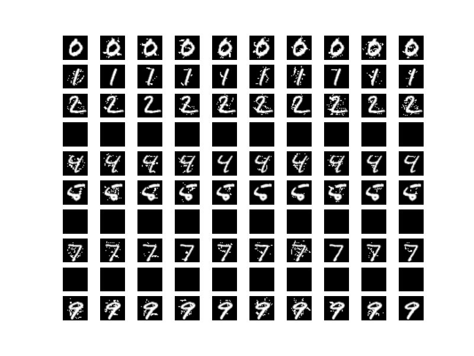

# Tutorial Cleverhans

Crear un nuevo proyecto en el portal web e inicializarlo.

```
cd cleverhans
floyd init cleverhans
```

## Ataques contra MNIST

### Fast Gradient Sign Method (FGSM)

Referencia: [Explaining and Harnessing Adversarial Examples](https://arxiv.org/abs/1412.6572)

> NOTA: No es necesario añadir el parámetro `--data`. El script descarga los datos de forma automática.

```
floyd run --gpu --env tensorflow-1.3:py2 'python cleverhans_tutorials/mnist_tutorial_tf.py > /output/fgsm.txt'
```

#### Resultados


```
Successfully downloaded train-images-idx3-ubyte.gz 9912422 bytes.
Extracting /tmp/train-images-idx3-ubyte.gz
Successfully downloaded train-labels-idx1-ubyte.gz 28881 bytes.
Extracting /tmp/train-labels-idx1-ubyte.gz
Successfully downloaded t10k-images-idx3-ubyte.gz 1648877 bytes.
Extracting /tmp/t10k-images-idx3-ubyte.gz
Successfully downloaded t10k-labels-idx1-ubyte.gz 4542 bytes.
Extracting /tmp/t10k-labels-idx1-ubyte.gz
X_train shape: (60000, 28, 28, 1)
X_test shape: (10000, 28, 28, 1)
Test accuracy on legitimate examples: 0.9881
Test accuracy on legitimate examples: 0.9895
Test accuracy on legitimate examples: 0.9927
Test accuracy on legitimate examples: 0.9910
Test accuracy on legitimate examples: 0.9925
Test accuracy on legitimate examples: 0.9922
Test accuracy on adversarial examples: 0.1239

Repeating the process, using adversarial training
Test accuracy on legitimate examples: 0.9771
Test accuracy on adversarial examples: 0.8554
Test accuracy on legitimate examples: 0.9884
Test accuracy on adversarial examples: 0.9027
Test accuracy on legitimate examples: 0.9893
Test accuracy on adversarial examples: 0.9315
Test accuracy on legitimate examples: 0.9909
Test accuracy on adversarial examples: 0.9458
Test accuracy on legitimate examples: 0.9910
Test accuracy on adversarial examples: 0.9463
Test accuracy on legitimate examples: 0.9925
Test accuracy on adversarial examples: 0.9480
```

## Jacobian-based Saliency Map Approach (JSMA)

Referencia: [The Limitations of Deep Learning in Adversarial Settings](https://arxiv.org/abs/1511.07528)

```
floyd run --gpu --env tensorflow-1.3:py2 'python cleverhans_tutorials/mnist_tutorial_jsma.py > /output/jsma.txt'
```




### Resultados

```
Created TensorFlow session.
Successfully downloaded train-images-idx3-ubyte.gz 9912422 bytes.
Extracting /tmp/train-images-idx3-ubyte.gz
Successfully downloaded train-labels-idx1-ubyte.gz 28881 bytes.
Extracting /tmp/train-labels-idx1-ubyte.gz
Successfully downloaded t10k-images-idx3-ubyte.gz 1648877 bytes.
Extracting /tmp/t10k-images-idx3-ubyte.gz
Successfully downloaded t10k-labels-idx1-ubyte.gz 4542 bytes.
Extracting /tmp/t10k-labels-idx1-ubyte.gz
X_train shape: (60000, 28, 28, 1)
X_test shape: (10000, 28, 28, 1)
Defined TensorFlow model graph.
Test accuracy on legitimate test examples: 0.9896
Crafting 10 * 9 adversarial examples
--------------------------------------
Attacking input 1/10
Generating adv. example for target class 0
Generating adv. example for target class 1
Generating adv. example for target class 2
Generating adv. example for target class 3
Generating adv. example for target class 4
Generating adv. example for target class 5
Generating adv. example for target class 6
Generating adv. example for target class 8
Generating adv. example for target class 9
--------------------------------------
Attacking input 2/10
Generating adv. example for target class 0
Generating adv. example for target class 1
Generating adv. example for target class 3
Generating adv. example for target class 4
Generating adv. example for target class 5
Generating adv. example for target class 6
Generating adv. example for target class 7
Generating adv. example for target class 8
Generating adv. example for target class 9
--------------------------------------
Attacking input 3/10
Generating adv. example for target class 0
Generating adv. example for target class 2
Generating adv. example for target class 3
Generating adv. example for target class 4
Generating adv. example for target class 5
Generating adv. example for target class 6
Generating adv. example for target class 7
Generating adv. example for target class 8
Generating adv. example for target class 9
--------------------------------------
Attacking input 4/10
Generating adv. example for target class 1
Generating adv. example for target class 2
Generating adv. example for target class 3
Generating adv. example for target class 4
Generating adv. example for target class 5
Generating adv. example for target class 6
Generating adv. example for target class 7
Generating adv. example for target class 8
Generating adv. example for target class 9
--------------------------------------
Attacking input 5/10
Generating adv. example for target class 0
Generating adv. example for target class 1
Generating adv. example for target class 2
Generating adv. example for target class 3
Generating adv. example for target class 5
Generating adv. example for target class 6
Generating adv. example for target class 7
Generating adv. example for target class 8
Generating adv. example for target class 9
--------------------------------------
Attacking input 6/10
Generating adv. example for target class 0
Generating adv. example for target class 2
Generating adv. example for target class 3
Generating adv. example for target class 4
Generating adv. example for target class 5
Generating adv. example for target class 6
Generating adv. example for target class 7
Generating adv. example for target class 8
Generating adv. example for target class 9
--------------------------------------
Attacking input 7/10
Generating adv. example for target class 0
Generating adv. example for target class 1
Generating adv. example for target class 2
Generating adv. example for target class 3
Generating adv. example for target class 5
Generating adv. example for target class 6
Generating adv. example for target class 7
Generating adv. example for target class 8
Generating adv. example for target class 9
--------------------------------------
Attacking input 8/10
Generating adv. example for target class 0
Generating adv. example for target class 1
Generating adv. example for target class 2
Generating adv. example for target class 3
Generating adv. example for target class 4
Generating adv. example for target class 5
Generating adv. example for target class 6
Generating adv. example for target class 7
Generating adv. example for target class 8
--------------------------------------
Attacking input 9/10
Generating adv. example for target class 0
Generating adv. example for target class 1
Generating adv. example for target class 2
Generating adv. example for target class 3
Generating adv. example for target class 4
Generating adv. example for target class 6
Generating adv. example for target class 7
Generating adv. example for target class 8
Generating adv. example for target class 9
--------------------------------------
Attacking input 10/10
Generating adv. example for target class 0
Generating adv. example for target class 1
Generating adv. example for target class 2
Generating adv. example for target class 3
Generating adv. example for target class 4
Generating adv. example for target class 5
Generating adv. example for target class 6
Generating adv. example for target class 7
Generating adv. example for target class 8
--------------------------------------
Avg. rate of successful adv. examples 1.0000
Avg. rate of perturbed features 0.0288
Avg. rate of perturbed features for successful adversarial examples 0.0288

```

## Black-Box attack

Referencia: [Practical Black-Box Attacks against Machine Learning](https://arxiv.org/abs/1602.02697)

> NOTA: No es necesario añadir el parámetro `--data`. El script descarga los datos de forma automática.

```
floyd run --gpu --env tensorflow-1.3:py2 'python cleverhans_tutorials/mnist_blackbox.py > /output/black-box.txt'
```

### Resultados

```
Successfully downloaded train-images-idx3-ubyte.gz 9912422 bytes.
Extracting /tmp/train-images-idx3-ubyte.gz
Successfully downloaded train-labels-idx1-ubyte.gz 28881 bytes.
Extracting /tmp/train-labels-idx1-ubyte.gz
Successfully downloaded t10k-images-idx3-ubyte.gz 1648877 bytes.
Extracting /tmp/t10k-images-idx3-ubyte.gz
Successfully downloaded t10k-labels-idx1-ubyte.gz 4542 bytes.
Extracting /tmp/t10k-labels-idx1-ubyte.gz
X_train shape: (60000, 28, 28, 1)
X_test shape: (10000, 28, 28, 1)
Preparing the black-box model.
Defined TensorFlow model graph.
Test accuracy of black-box on legitimate test examples: 0.988426395201
Training the substitute model.
Defined TensorFlow model graph for the substitute.
Substitute training epoch #0
Augmenting substitute training data.
Labeling substitute training data.
Substitute training epoch #1
Augmenting substitute training data.
Labeling substitute training data.
Substitute training epoch #2
Augmenting substitute training data.
Labeling substitute training data.
Substitute training epoch #3
Augmenting substitute training data.
Labeling substitute training data.
Substitute training epoch #4
Augmenting substitute training data.
Labeling substitute training data.
Substitute training epoch #5
Test accuracy of oracle on adversarial examples generated using the substitute: 0.816954314563
```
