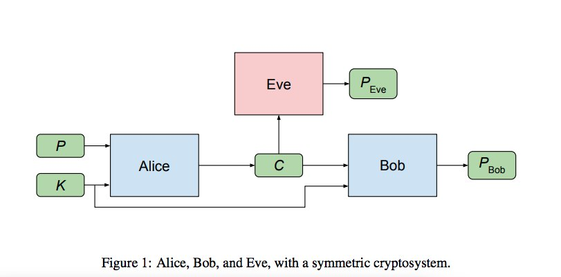
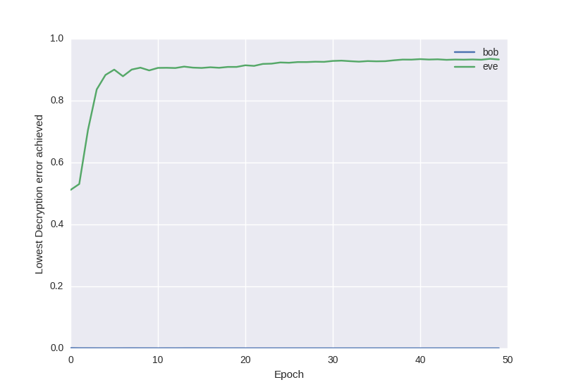

# Adversarial cryptography

Referencia: [Learning to Protect Communications with Adversarial Neural Cryptography](https://arxiv.org/abs/1610.06918)

Implementaciones:
* [neural-cryptography-tensorflow](https://github.com/vishal3011/Adversarial-Neural-Cryptography)
* [adversarial-neural-crypt](https://github.com/nlml/adversarial-neural-crypt)
* [Neural Networks that invent their own encryption](https://github.com/ankeshanand/neural-cryptography-tensorflow)

## Arquitectura

## Resultados

### 32 bits

### 64 bits

