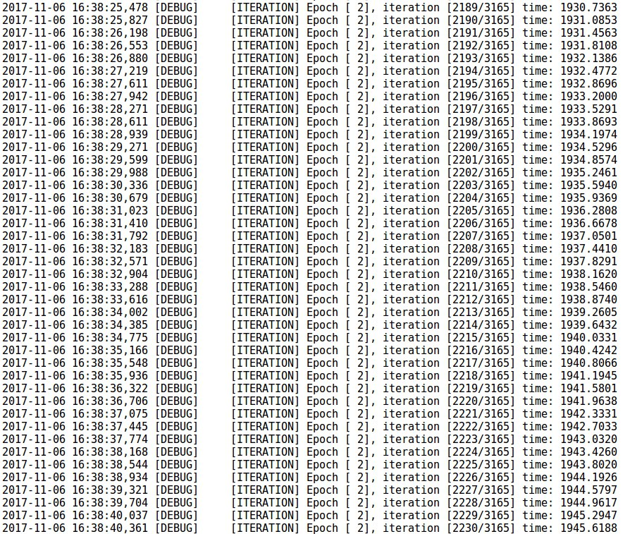

# Deep Pwning

Código: [Metasploit for machine learning.](https://github.com/cchio/deep-pwning)

Charla: [DEF CON 24 - Clarence Chio - Machine Duping 101: Pwning Deep Learning Systems](https://www.youtube.com/watch?v=JAGDpJFFM2A)

> Nota: es obligaoria la versión 0.8.0 de Tensorflow.

## Resultados

