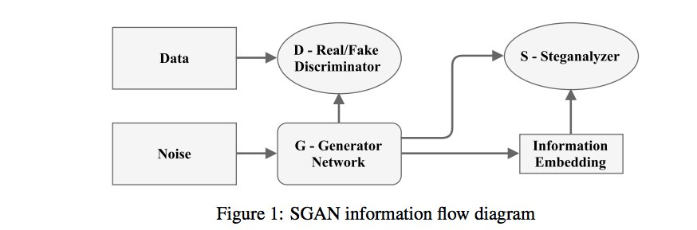

# Adversarial Steganography

Referencia: [Steganographic Generative Adversarial Networks](https://arxiv.org/pdf/1703.05502.pdf)

Código: [Adversarial Steganography](https://github.com/dvolkhonskiy/adversarial-steganography)

> Nota: es posible que sea necesario cambiar el código para hacerlo funcionar correctamente.

## Arquitectura

## Resultados

