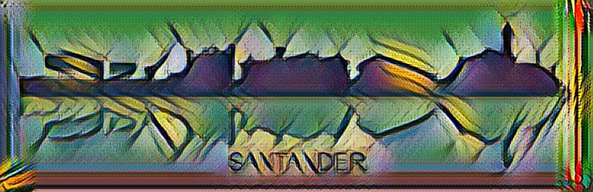

# Tutorial FloydHub (transferencia de estilo)

1. Crear una cuenta en [FloydHub](https://floydhub.com).
2. Instalar `floyd-cli`.
> Es necesario tener instalado `python` y `pip`.

  Ejecutar `pip install -U floyd-cli` en la terminal.

  > Si no funciona, crear un entorno virtual con `virtualenv`.

  > Ejecutar `sudo pip install virtualenv`.

  > Crear un nuevo entorno virtual `virtualenv ~/floyd`.

  > Activar el entorno con `source ~/floyd/bin/activate`.

3. Hacer login con `floyd login`. Seguir las instrucciones en pantalla.

4. Ir a la carpeta `transferencia_de_estilo/codigo` o clonar el repositorio con el código.

  ```
  git clone https://github.com/lengstrom/fast-style-transfer codigo
  cd fast-style-transfer
  ```

5. Inicializar el proyecto local con `floyd init fast-style-transfer`. Seguir las instrucciones de la terminal.

6. Subir los modelos y las fotos.

  6.1. Crear dos `datasets` en el panel de control de `FloydHub` con nombres `fotos` y `estilos`.

  6.2. Ir a la carpeta `fotos` y subir las imágenes a los servidores de `FloydHub`.
    ```
    floyd data init fotos
    floyd data upload
    ```
  6.3. Repetir el punto anterior en la carpeta `estilos`.

    ```
    floyd data init estilos
    floyd data upload
    ```

7. Entrenar el modelo preentrenado.

  > ADVERTENCIA: Puede tardar mucho tiempo si no se ejecuta con GPU.

  ```
  cd ../codigo
  floyd run --gpu --env tensorflow-1.3:py2 --data narenst/datasets/coco-train-2014/1:images --data narenst/datasets/neural-style-transfer-pre-trained-models/1:models --data floydhub/datasets/imagenet-vgg-verydeep-19/3:vgg "python style.py --vgg-path /vgg/imagenet-vgg-verydeep-19.mat --train-path /images/train2014 --style examples/style/wave.jpg --base-model-path /models/wave.ckpt --epoch 1 --total-iterations 10 --checkpoint-dir /output"

  ```

  

8. Carpeta de salida del modelo. `floyd info <RUN_ID>`.

9. Evaluar modelo con las imágenes del dataset `fotos`.

  ```
  floyd run --env tensorflow-1.3:py2 --data <ID_DATASET_ESTILOS>:/estilos --data <ID_DATASET_FOTOS>:/fotos "python evaluate.py --allow-different-dimensions --checkpoint /estilos/wave.ckpt --in-path /fotos --out-path /output --batch-size 1"
  ```

10. Ver imágenes obtenidas. `floyd output <RUN_ID2>`.

Un tutorial más completo se puede ver en [https://docs.floydhub.com/examples/style_transfer/](https://docs.floydhub.com/examples/style_transfer).

Más tutoriales con Tensorflow en [https://github.com/floydhub/tensorflow-notebooks-examples](https://github.com/floydhub/tensorflow-notebooks-examples).

## Resultados

### Estilo de La gran ola de Kanagawa (wave)

<p align="center">
  
</p>

Original             |  Transformada
:-------------------------:|:-------------------------:
  |  
  |  
  |  
  |  
  |  


### Estilo de La musa (la_muse)

<p align="center">
  
</p>

Original             |  Transformada
:-------------------------:|:-------------------------:
  |  
  |  
  |  
  |  
  |  


### Estilo de El hundimiento del HMS Minotaur (wreck)

<p align="center">
  
</p>

Original             |  Transformada
:-------------------------:|:-------------------------:
  |  
  |  
  |  
  |  
  |  


### Estilo de Udnie, Young American Girl (udnie)

<p align="center">
  
</p>

Original             |  Transformada
:-------------------------:|:-------------------------:
  |  
  |  
  |  
  |  
  |  


### Estilo de Rain Princess (rain_princess)

<p align="center">
  
</p>

Original             |  Transformada
:-------------------------:|:-------------------------:
  |  
  |  
  |  
  |  
  |  


### Estilo de El Grito (scream)

<p align="center">
  
</p>

Original             |  Transformada
:-------------------------:|:-------------------------:
  |  
  |  
  |  
  |  
  |  
