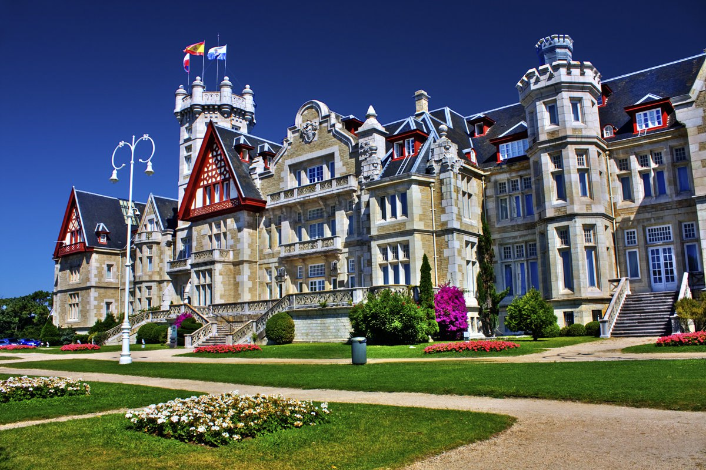
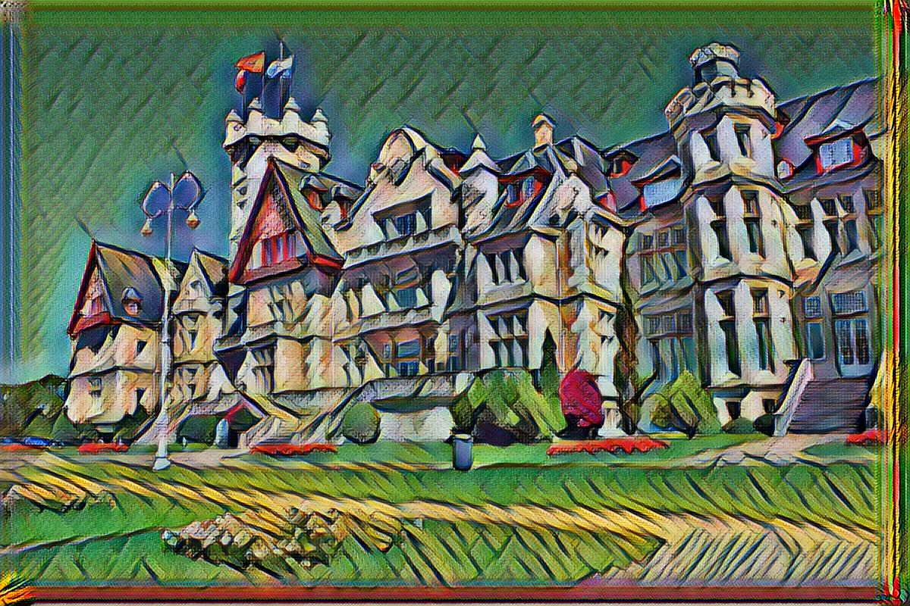
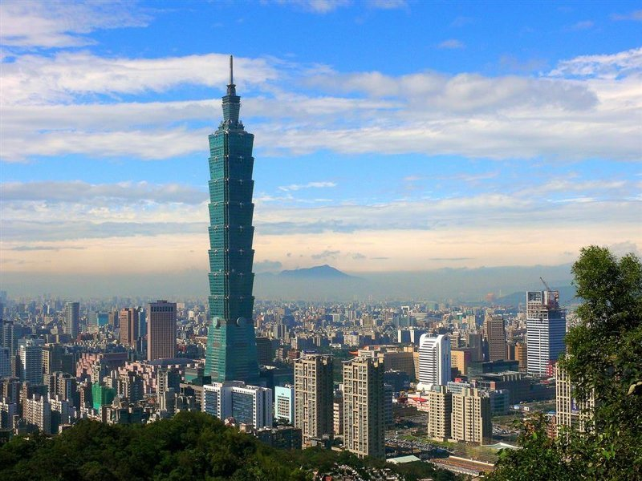
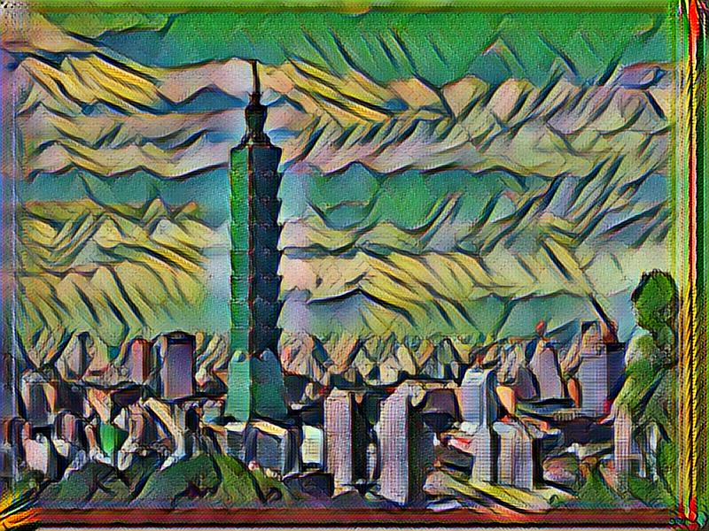

# Tutorial FloydHub

1. Crear una cuenta en [FloydHub](https://floydhub.com).
2. Instalar `floyd-cli`.
> Es necesario tener instalado `python` y `pip`.

  Ejecutar `pip install -U floyd-cli` en la terminal.

  > Si no funciona, crear un entorno virtual con `virtualenv`.

  > Ejecutar `sudo pip install virtualenv`.

  > Crear un nuevo entorno virtual `virtualenv ~/floyd`.

  > Activar el entorno con `source ~/floyd/bin/activate`.

3. Hacer login con `floyd login`. Seguir las instrucciones en pantalla.

4. Clonar el repositorio con el código. `git clone https://github.com/floydhub/fast-style-transfer`.

5. `cd fast-style-transfer`.

6. Inicializar el proyecto local con `floyd init fast-style-transfer`. Seguir las instrucciones de la terminal.

7. Ejecutar el modelo preentrenado.

  > Puede tardar alrededor de 20 minutos si no se ejecuta con GPU.

  ``` floyd run --gpu --env tensorflow-0.12:py2 --data jq4ZXUCSVer4t65rWeyieG "python style.py --style examples/style/la_muse.jpg --base-model-path /input/pre-trained-tf/la_muse.ckpt --epoch 1 --total-iterations 10 --checkpoint-dir /output"```

  

8. Carpeta de salida del modelo. `floyd info <RUN_ID>`.

9. Evaluar modelo en las imágenes de la carpeta `images`.

  ```floyd run --env tensorflow-0.12:py2 --data <OUTPUT_ID_FROM_TRAINING> "python evaluate.py --allow-different-dimensions --checkpoint /input/fns.ckpt --in-path ./images/ --out-path /output/"
  ```

10. Ver imágenes obtenidas. `floyd output <RUN_ID2>`.

Un tutorial más completo se puede ver en [https://docs.floydhub.com/examples/style_transfer/](https://docs.floydhub.com/examples/style_transfer).

Más tutoriales con Tensorflow en [https://github.com/floydhub/tensorflow-notebooks-examples](https://github.com/floydhub/tensorflow-notebooks-examples).

## Resultados con el estilo de La Musa, de Picasso

<p align="center">
  
</p>

### Palacio de la Magdalena

Original             |  Transformada
:-------------------------:|:-------------------------:
  |  

### Taipei 101

Original             |  Transformada
:-------------------------:|:-------------------------:
  |  
